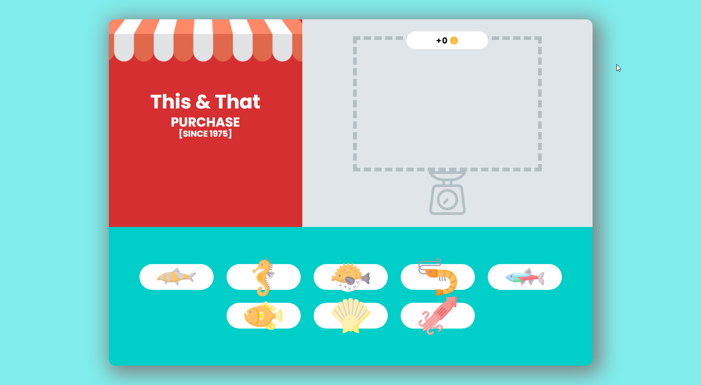

# Fishing-shop

## Description

This project is part of the Frontenders Community. 

Fishing Shop it's a web page app developed using plain JavaScript. It represents a fish shop where you can drag and drop fishes from the counter to the scale, and the price will be calculated accordingly.

## Features

- Drag and Drop features.
- Dynamic price calculation as items are dragged onto the scale.

## Technology

  
 
  
  

## Demo

To see a live demo of the Fishing-shop, visit [Demo](https://www.massidev.com/portfolio/fishing-shop/).

## Installation

To run the Fishing-shop locally, follow these steps:

1. Clone the repository: `git clone https://github.com/massi-17/fishing-shop.git`
2. Navigate to the project directory: `cd fishing-shop`
3. Open the `index.html` file in your preferred web browser.

## Contributing

Contributions are welcome! If you want to contribute to this Fishing-shop, please follow these steps:

1. Fork the repository.
2. Create a new branch: `git checkout -b feature/your-feature`.
3. Make your changes and commit them: `git commit -m 'Add your feature'`.
4. Push to the branch: `git push origin feature/your-feature`.
5. Submit a pull request.

